# Visualization Foundations {#lesson05}

:::cdi-message
- **ID:** DS-L05
- **Type:** Lesson
- **Audience:** Beginner / Intermediate
- **Theme:** Foundational data visualization using clear, reproducible workflows
:::

Visualization is one of the most important tools in data science.

A good plot helps reveal structure, compare groups, identify unusual values, and communicate findings clearly.

But visualization is not only about producing charts.

It is also about learning how to read evidence from patterns.

In this lesson, we focus on foundational plot types that appear in real analytical workflows. We use the wrangled Iris dataset from Chapter 04 so that the visualization step builds on the outputs already produced by the system.

---

## Lesson overview

By the end of this lesson, you will be able to:

- create histograms, density plots, ECDF plots, boxplots, violin plots,
  scatter plots, heatmaps, and pairplots
- compare numeric distributions across groups
- compare alternative figures for the same analytical question
- use color to represent categories clearly
- interpret patterns, spread, overlap, and separation
- save figures as reusable analysis outputs
- run a reusable plotting script from the command line

---

## Chapter workflow

This chapter introduces the fourth reusable Python script in the system:

```text
05-visualization-basics.qmd
        ↓
scripts/python/plot_example_data.py
        ↓
data/iris_wrangled.csv
results/figures/
results/figures/figure-index.tsv
```

The figures produced here support interpretation and reporting in later chapters.

---

## Build a visual story

A useful collection of figures should feel like a guided story rather than a
random gallery.

In this chapter, the story moves through five questions:

1. **What does one variable look like?**
2. **How do its distributions differ across species?**
3. **How do groups compare in center, spread, and individual observations?**
4. **How are two measurements related?**
5. **What broader multivariable structure is visible?**

Different plots can answer the same question from different angles. Showing
more than one view is especially valuable when each view reveals something
the others hide.

---

## Load the wrangled dataset

We use the wrangled dataset prepared in Chapter 04.

```python
import pandas as pd
import matplotlib.pyplot as plt
import seaborn as sns

df = pd.read_csv("data/iris_wrangled.csv")
df.head()
```

---

## Inspect the variables

Before plotting, confirm the structure of the dataset.

```python
print("Shape:", df.shape)
print("\nColumns:", df.columns.tolist())
print("\nData types:")
print(df.dtypes)
```

### Interpretation

Before making plots, ask:

- which variables are numeric?
- which variable defines the groups?
- which comparisons are likely to be meaningful?
- which derived features are available from the wrangling step?

For the Iris dataset, the numeric flower measurements, the derived `petal_area`, and the categorical `species` variable support both distribution plots and grouped comparisons.

---

## Histogram

Histograms help us understand the distribution of a single numeric variable.

```python
fig, ax = plt.subplots(figsize=(8, 5.5))

sns.histplot(
    data=df,
    x="sepal_length",
    bins=12,
    kde=True,
    ax=ax
)

ax.set_title("Distribution of Sepal Length")
ax.set_xlabel("Sepal Length")
ax.set_ylabel("Count")

plt.show()
```

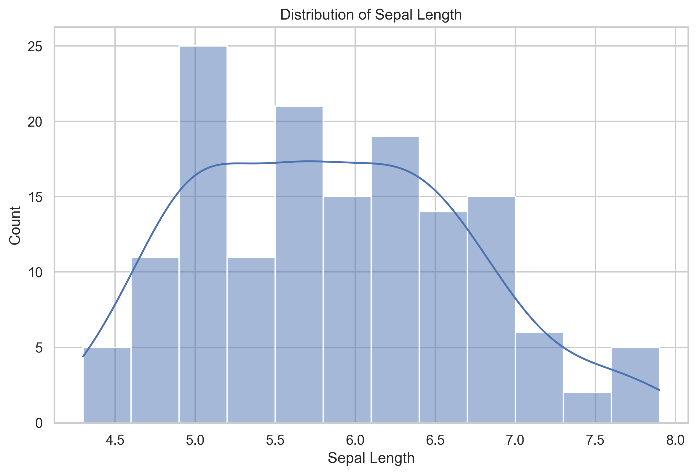{fig-alt="Histogram of sepal length with a smooth density curve."}

### Interpretation

When reading a histogram, look for:

- the center of the distribution
- the spread of values
- skewness
- possible multiple peaks

If a variable shows multiple peaks, this may suggest the presence of meaningful subgroups.

---

## Three views of one distribution

A histogram is familiar, but it is not the only way to examine a numeric
distribution. The following three-panel figure shows the same
`sepal_length` values as a histogram, a density curve, and an empirical
cumulative distribution function (ECDF).

```python
fig, axes = plt.subplots(1, 3, figsize=(15, 4.5))

sns.histplot(data=df, x="sepal_length", bins=12, ax=axes[0])
axes[0].set_title("Histogram")
axes[0].set_ylabel("Count")

sns.kdeplot(data=df, x="sepal_length", fill=True, ax=axes[1])
axes[1].set_title("Density")
axes[1].set_ylabel("Density")

sns.ecdfplot(data=df, x="sepal_length", ax=axes[2])
axes[2].set_title("ECDF")
axes[2].set_ylabel("Proportion at or below")

fig.suptitle("Three Views of Sepal Length", y=1.03)
plt.tight_layout()
plt.show()
```

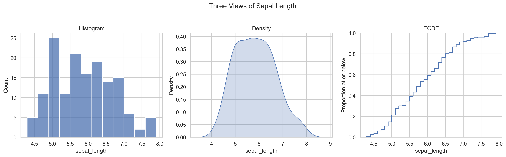{fig-alt="A three-panel figure showing a histogram, density plot, and empirical cumulative distribution of sepal length."}

### Interpretation

- The **histogram** makes frequencies and possible peaks easy to see, but its
  appearance depends on the selected bins.
- The **density plot** emphasizes the overall shape, but smoothing can hide
  small details.
- The **ECDF** shows the proportion of observations at or below any value
  without requiring bins or smoothing.

These are alternatives, not competitors. The best choice depends on the
question and the audience.

---

## Boxplot

Boxplots summarize a distribution using the median, quartiles, and possible outliers.

```python
fig, ax = plt.subplots(figsize=(8, 5.5))

sns.boxplot(
    data=df,
    x="species",
    y="sepal_length",
    ax=ax
)

ax.set_title("Sepal Length by Species")
ax.set_xlabel("Species")
ax.set_ylabel("Sepal Length")

plt.show()
```

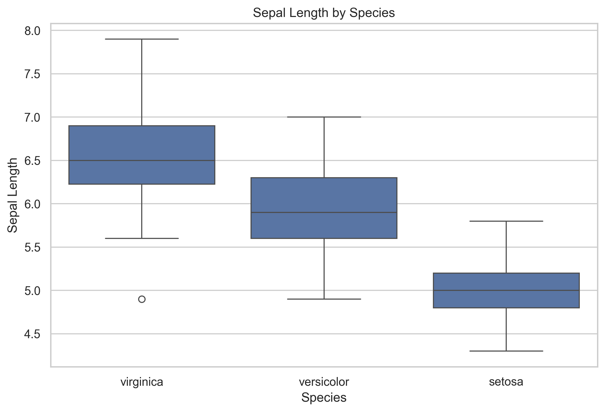{fig-alt="Boxplots of sepal length for setosa, versicolor, and virginica."}

### Interpretation

A boxplot helps compare groups by showing:

- differences in typical values through the median
- variation within each group
- possible outliers
- overlap across groups

If two groups overlap strongly, that variable alone may not separate them well.

---

## Scatter plot

Scatter plots show the relationship between two numeric variables.

```python
fig, ax = plt.subplots(figsize=(8, 5.5))

sns.scatterplot(
    data=df,
    x="sepal_length",
    y="petal_length",
    hue="species",
    s=70,
    alpha=0.8,
    ax=ax
)

ax.set_title("Sepal Length vs Petal Length")
ax.set_xlabel("Sepal Length")
ax.set_ylabel("Petal Length")

plt.show()
```

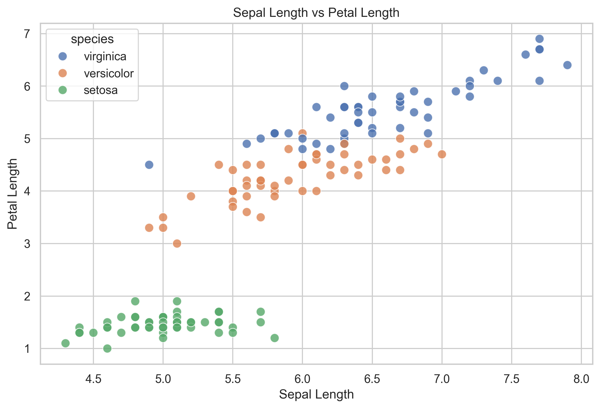{fig-alt="Scatter plot of sepal length against petal length with observations colored by Iris species."}

### Interpretation

Scatter plots help you evaluate:

- whether two variables move together
- whether groups form distinct clusters
- whether the pattern appears linear or non-linear
- whether any observations appear unusual

In many datasets, scatter plots are among the fastest ways to detect group structure.

---

## Grouped histogram

A grouped histogram helps compare distributions across categories.

```python
fig, ax = plt.subplots(figsize=(8, 5.5))

sns.histplot(
    data=df,
    x="petal_length",
    hue="species",
    bins=15,
    kde=True,
    ax=ax
)

ax.set_title("Petal Length Distribution by Species")
ax.set_xlabel("Petal Length")
ax.set_ylabel("Count")

plt.show()
```

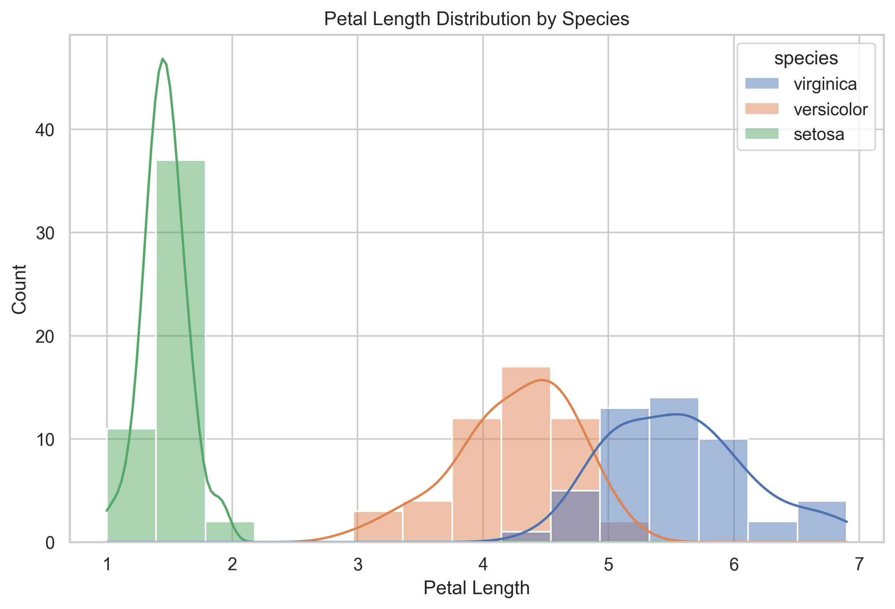{fig-alt="Grouped histogram of petal length with a separate color and density curve for each Iris species."}

### Interpretation

This plot helps compare whether groups differ in:

- location
- spread
- overlap
- shape of the distribution

If one group's values occupy a clearly different range, that variable may be useful for distinguishing between groups.

---

## Small-multiple histograms

Overlaid distributions can become crowded. Small multiples give every species
its own panel while preserving a common scale.

```python
g = sns.displot(
    data=df,
    x="petal_length",
    col="species",
    col_wrap=3,
    bins=10,
    kde=True,
    height=3.5,
    aspect=1
)

g.set_axis_labels("Petal Length", "Count")
g.set_titles("{col_name}")
g.fig.suptitle("Petal Length Distribution within Each Species", y=1.05)

plt.show()
```

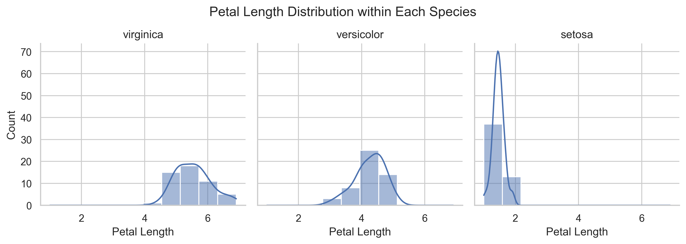{fig-alt="Three aligned histogram panels showing petal length separately for setosa, versicolor, and virginica."}

### Interpretation

The grouped histogram is best for seeing overlap directly. The small-multiple
version is often easier for comparing the shape and spread within each group.
Using both views shows that setosa is clearly separated, while versicolor and
virginica retain some overlap.

---

## Derived feature plot

Because Chapter 04 created `petal_area`, we can now visualize it directly.

```python
fig, ax = plt.subplots(figsize=(8, 5.5))

sns.boxplot(
    data=df,
    x="species",
    y="petal_area",
    ax=ax
)

sns.stripplot(
    data=df,
    x="species",
    y="petal_area",
    color="black",
    alpha=0.55,
    size=4,
    jitter=0.22,
    ax=ax
)

ax.set_title("Petal Area by Species")
ax.set_xlabel("Species")
ax.set_ylabel("Petal Area")

plt.show()
```

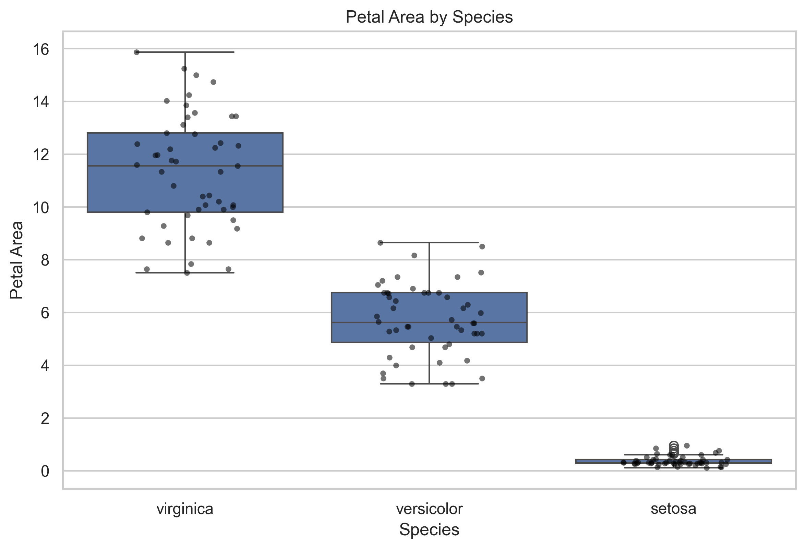{fig-alt="Boxplots of petal area for each Iris species with jittered observations overlaid."}

### Interpretation

This plot connects wrangling to visualization.

A derived feature is only useful if it helps answer a question or clarify a pattern. Here, `petal_area` gives a compact petal-size measure that separates species more clearly than many sepal-based comparisons.

---

## Boxplot and violin plot comparison

Boxplots and violin plots summarize the same grouped distributions in
different ways.

```python
fig, axes = plt.subplots(1, 2, figsize=(13, 5.5), sharey=True)

sns.boxplot(data=df, x="species", y="petal_area", ax=axes[0])
axes[0].set_title("Boxplot")
axes[0].set_xlabel("Species")
axes[0].set_ylabel("Petal Area")

sns.violinplot(
    data=df,
    x="species",
    y="petal_area",
    inner="quartile",
    cut=0,
    ax=axes[1]
)
sns.stripplot(
    data=df,
    x="species",
    y="petal_area",
    color="black",
    alpha=0.4,
    size=3,
    jitter=0.16,
    ax=axes[1]
)
axes[1].set_title("Violin Plot with Observations")
axes[1].set_xlabel("Species")
axes[1].set_ylabel("")

fig.suptitle("Two Views of Petal Area by Species", y=1.02)
plt.tight_layout()
plt.show()
```

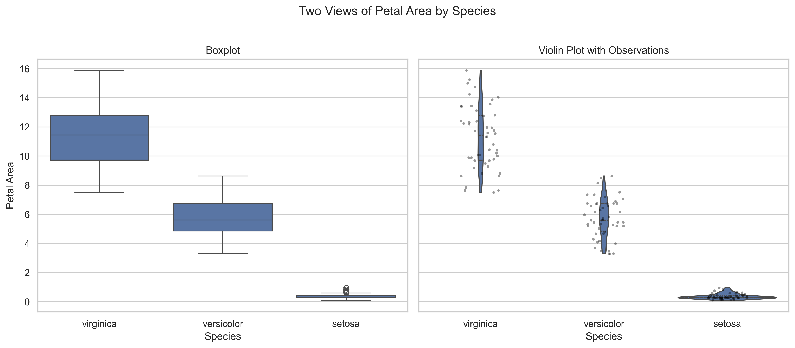{fig-alt="A two-panel comparison of boxplots and violin plots with individual observations for petal area across Iris species."}

### Interpretation

The boxplot gives a compact summary of the median and quartiles. The violin
plot reveals the estimated distribution shape, while the overlaid points keep
the individual observations visible. For small datasets, displaying the
observations helps prevent a smooth distribution from appearing more precise
than the data support.

---

## Scatter plot with trend lines

The earlier scatter plot emphasizes clusters. Adding a separate trend line for
each species helps compare within-group relationships.

```python
g = sns.lmplot(
    data=df,
    x="sepal_length",
    y="petal_length",
    hue="species",
    height=5.5,
    aspect=1.35,
    scatter_kws={"s": 55, "alpha": 0.75},
    ci=None
)

g.set_axis_labels("Sepal Length", "Petal Length")
g.fig.suptitle("Within-Species Trends: Sepal Length vs Petal Length", y=1.03)

plt.show()
```

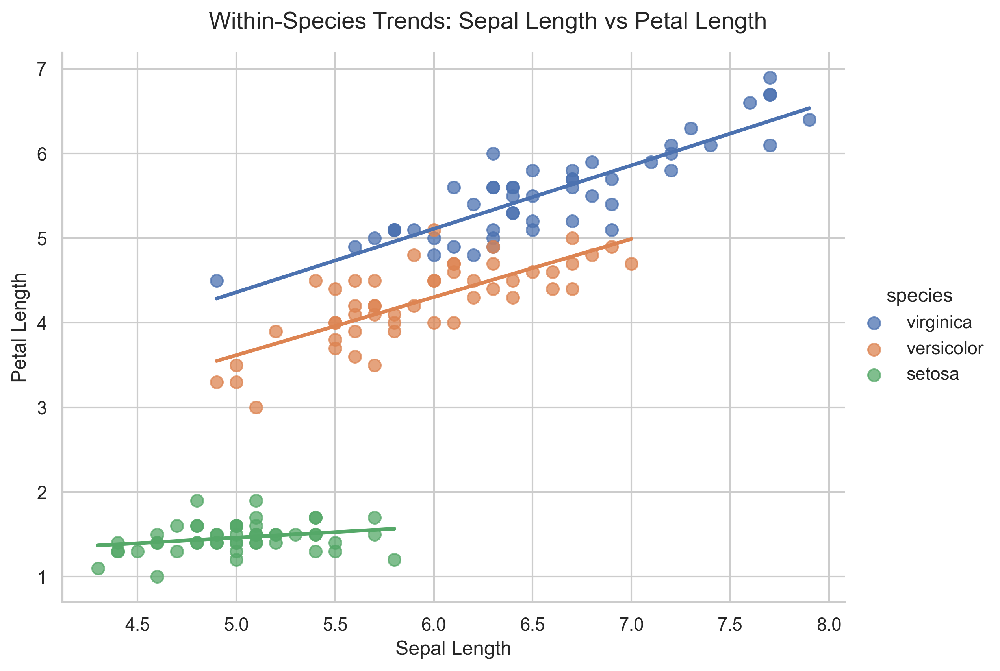{fig-alt="Scatter plot of sepal length against petal length with a separate fitted linear trend for each Iris species."}

### Interpretation

The overall upward pattern partly reflects differences between species.
Within-species trend lines help separate that group structure from the
relationship observed inside each species. A visible overall association does
not always mean the same relationship is equally strong within every group.

---

## Correlation heatmap

A correlation heatmap provides a compact overview of linear relationships
among all numeric features.

```python
numeric_columns = [
    "sepal_length",
    "sepal_width",
    "petal_length",
    "petal_width",
    "petal_area"
]

correlations = df[numeric_columns].corr()

fig, ax = plt.subplots(figsize=(8, 6.5))

sns.heatmap(
    correlations,
    annot=True,
    fmt=".2f",
    cmap="vlag",
    center=0,
    vmin=-1,
    vmax=1,
    square=True,
    ax=ax
)

ax.set_title("Correlation among Iris Numeric Features")
plt.tight_layout()
plt.show()
```

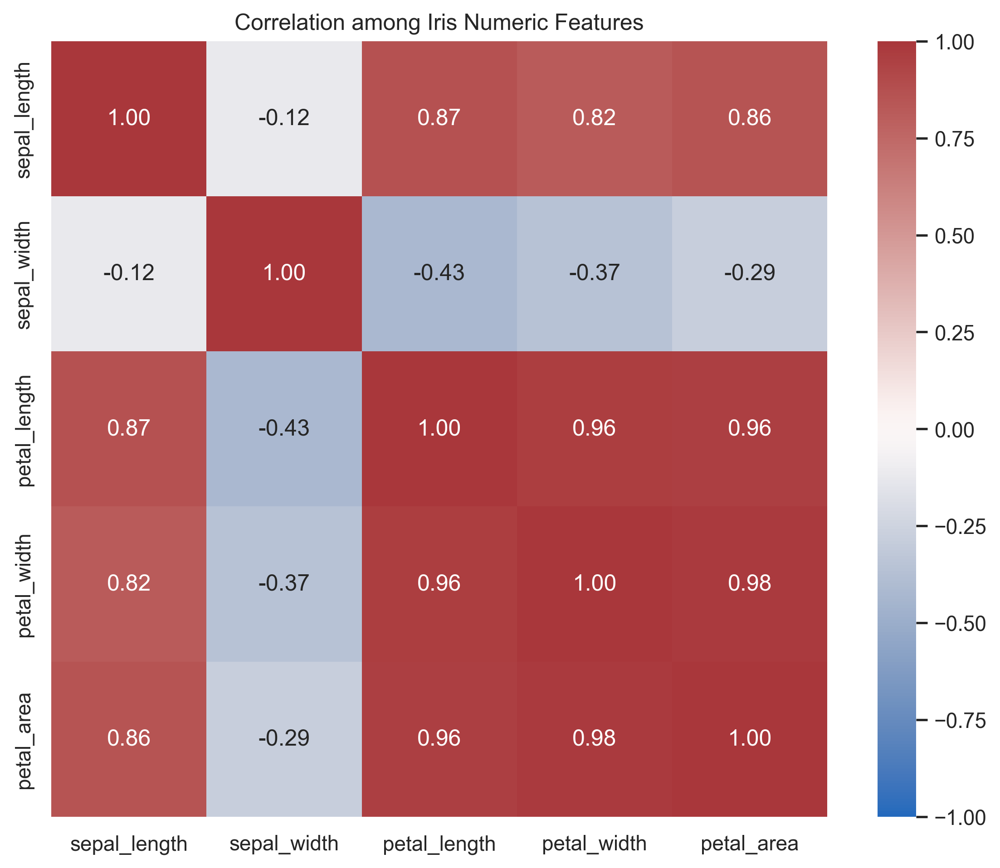{fig-alt="Correlation matrix heatmap for sepal length, sepal width, petal length, petal width, and petal area."}

### Interpretation

Petal length, petal width, and petal area are strongly related. This agrees
with the scatter plots and helps identify features that may carry similar
information. Correlation summarizes linear association; it does not explain
causation or replace inspection of the underlying points.

---

## Pairplot overview

Pairplots provide a compact view of multiple variable relationships at once.

```python
g = sns.pairplot(
    df[[
        "sepal_length",
        "sepal_width",
        "petal_length",
        "petal_width",
        "petal_area",
        "species"
    ]],
    hue="species",
    corner=True,
    plot_kws={"alpha": 0.7}
)

g.fig.suptitle("Iris — Pairwise Relationships by Species", y=1.02)

plt.show()
```

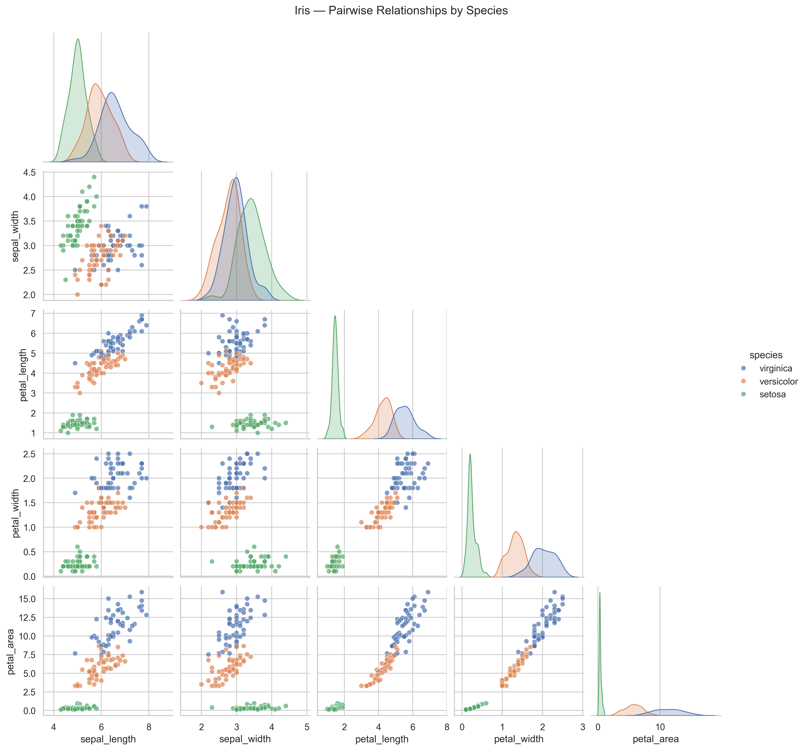{fig-alt="Corner pairplot of sepal length, sepal width, petal length, petal width, and petal area, colored by Iris species."}

### Interpretation

Pairplots help answer broader questions such as:

- which variables best separate species?
- which features appear strongly related?
- which measurements appear redundant?
- where groups overlap and where they separate clearly?

This is often one of the most useful first multivariate views of a dataset.

---

## Reading visual evidence carefully

A plot is only useful if it is interpreted carefully.

When reading a figure, ask:

- what question does this plot help answer?
- what pattern is visible?
- how strong is the pattern?
- is there overlap, uncertainty, or ambiguity?
- does this align with earlier summaries?

Visualization should support reasoning, not replace it.

---

## Visualization principles

Strong foundational plots share a few key qualities:

- clear titles and labels
- readable axes
- purposeful use of color
- minimal clutter
- plot choice matched to the question

A histogram is useful for one-variable distributions.  
A boxplot is useful for comparing distributions across groups.  
A scatter plot is useful for relationships between two variables.  
A pairplot is useful for quick multivariate exploration.

---

## Validation through visualization

Plots can also function as validation tools.

Use them to check:

- whether distributions look plausible
- whether outliers need review
- whether grouped differences are real or mostly overlap
- whether patterns are consistent with earlier cleaning and wrangling steps

Visualization often reveals issues that summary tables alone can miss.

---

## Run the reusable plotting script

The manual plotting examples above explain the logic. The reusable script creates and saves a standard figure set.

Run this from the project root:

```bash
python scripts/python/plot_example_data.py data/iris_wrangled.csv results/figures
```

Expected outputs:

```text
results/figures/
├── histogram-sepal-length.png
├── distribution-views-sepal-length.png
├── boxplot-sepal-length-by-species.png
├── scatter-sepal-length-vs-petal-length.png
├── histogram-petal-length-by-species.png
├── small-multiples-petal-length-by-species.png
├── boxplot-petal-area-by-species.png
├── comparison-petal-area-by-species.png
├── scatter-trends-by-species.png
├── correlation-heatmap.png
├── pairplot-iris-by-species.png
└── figure-index.tsv
```

---

## What the plotting script does

The script:

- reads the wrangled input table
- validates required columns
- creates a varied set of exploratory and comparison figures
- saves figures as `.png` files
- writes a figure index table with filenames and descriptions

The figure index helps later reporting chapters refer to plots consistently.

---

## Exercise

Try the following:

1. Open `results/figures/figure-index.tsv`.
2. Open `results/figures/boxplot-petal-area-by-species.png`.
3. Compare the boxplot and violin plot of `petal_area`.
4. Create a scatter plot of `sepal_width` versus `petal_width`.
5. Plot both a histogram and an ECDF of `petal_width`.
6. Write one sentence describing which figure most clearly shows species
   separation and explain why.

---

::: {.callout-tip collapse="true"}
## Solution

```python
fig, ax = plt.subplots(figsize=(8, 5.5))

sns.scatterplot(
    data=df,
    x="sepal_width",
    y="petal_width",
    hue="species",
    s=70,
    alpha=0.8,
    ax=ax
)

ax.set_title("Sepal Width vs Petal Width")
ax.set_xlabel("Sepal Width")
ax.set_ylabel("Petal Width")

plt.show()

fig, axes = plt.subplots(1, 2, figsize=(12, 5))

sns.histplot(data=df, x="petal_width", bins=12, ax=axes[0])
axes[0].set_title("Histogram of Petal Width")
axes[0].set_xlabel("Petal Width")
axes[0].set_ylabel("Count")

sns.ecdfplot(data=df, x="petal_width", ax=axes[1])
axes[1].set_title("ECDF of Petal Width")
axes[1].set_xlabel("Petal Width")
axes[1].set_ylabel("Proportion at or below")

plt.tight_layout()
plt.show()

print(
    "The pairplot most clearly shows overall species separation because "
    "it compares several feature combinations in one coordinated view."
)
```

:::

---

## CDI Insight

Visualization is not about producing more plots.

It is about choosing the right view of the data to support understanding.

A clear plot reduces uncertainty. A poor plot can introduce it.

In CDI systems, figures should be reproducible outputs, not temporary screenshots. A saved figure, a figure index, and the script that produced them make visual evidence easier to review and reuse.

---

## Summary

In this lesson, you:

- used a varied set of foundational plot types to explore the Iris dataset
- compared multiple visual choices for the same question
- compared distributions within and across species
- examined relationships between numeric variables
- visualized the derived `petal_area` feature
- used a heatmap and pairplot to inspect multivariable structure
- used visual patterns to support interpretation
- saved reusable figures with `plot_example_data.py`
- created `results/figures/figure-index.tsv`

---

## Looking Ahead

In the next chapter, we summarize the analysis more formally. The wrangled tables and saved figures produced here become evidence for written interpretation.
